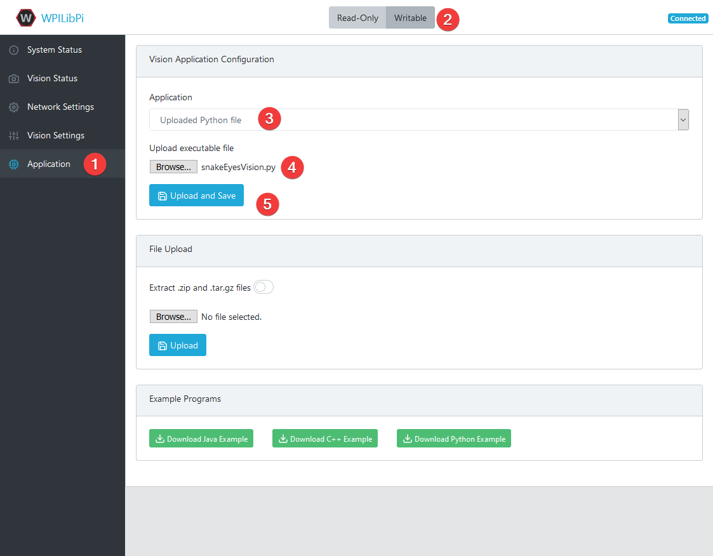

# WPILibPi and SnakeEyes

This sample code runs on the WPIlib Raspberry Pi Image, and performs basic image processing on an IR camera, as well as interfaces with an LED & power supply hat from Playing With Fusion.

The sample code assumes the Raspberry Pi NOIR camera is in use, and no other cameras are attached to the system.

# Getting Started

This procedure was last tested with the v2021.2.1 release of WPILib Pi.

## Code

Download a copy of the sample [`snakeEyesVision.py`](https://raw.githubusercontent.com/PlayingWithFusion/SnakeEyesDocs/master/FRCVision/snakeEyesVision.py) script. Modify the `TEAM_NUMBER` variable to match your team, along with other configuration as needed.

## Upload

[Download and flash the latest version of the FRCVision Raspberry Pi Image per their instructions.](https://docs.wpilib.org/en/stable/docs/software/vision-processing/raspberry-pi/installing-the-image-to-your-microsd-card.html)

Power the system up, visit the web interface, and ensure you can see the Raspberry Pi camera as the only camera on the system, and can view its stream.

[Reference the Vision Workflows documentation](https://docs.wpilib.org/en/stable/docs/software/vision-processing/raspberry-pi/the-raspberry-pi-frc-console.html#vision-workflows) to upload your modified `snakeEyesVision.py`.

> :bug: To debug, you can change to the `Vision Status` tab, and ensure you have messages indicating the vision processing logic has started.

> :bug: Note that the python example uses the `RPi.GPIO` libraries for controlling the pins as a simple proof of concept. However, since it only supports software PWM, you may see **occasional flickering** in the output intensity at partial values. In the future, we're looking to use `pigpio` as an alternative, but that requires more complex integration.

Once the code is running, visit [`http://wpilibpi.local:5805/stream.html`](http://wpilibpi.local:5805/stream.html) in a web browser to see a stream of the processed camera data and some stats.

You can read the target information from Network Tables values `targetX`, `targetY`, and `targetVisible`.

