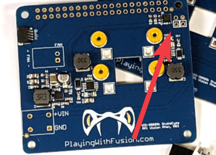
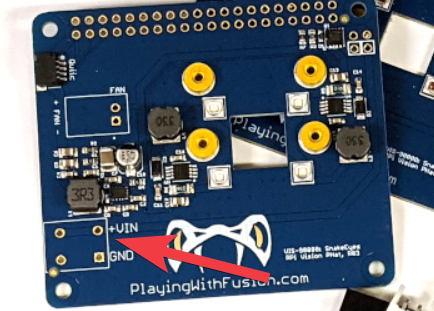

# Hardware

This page describes the minimum additional hardware required to enable all functionality of the SnakeEyes board.

> :warning: If you are using the [Sample Case Design](case/v1/sampleCase.md), be sure to read that page too - it has additional components and requirements above and beyond these minimum requirements.

## BOM

| No. | Description | Quantity | Example Source
| --- | --- | --- | --- |
| 1   | SnakeEyes Pi Hat | 1 | [Green](https://www.playingwithfusion.com/productview.php?catid=1014&pdid=133) or [IR](https://www.playingwithfusion.com/productview.php?pdid=134)
| 2   | Compatible Raspberry Pi | 1 | See below
| 3   | 20x2 0.1" pitch header | 1 | Included, or [Kit from Amazon.com](https://www.amazon.com/gp/product/B076H25ZB8)
| 4   | 2x2 0.1" pitch header | 1 | Included, or [Kit from Amazon.com](https://www.amazon.com/gp/product/B076H25ZB8)
| 5   | Pi V2 or V1.3 Camera | 1 | [Green](https://www.raspberrypi.org/products/camera-module-v2/?resellerType=home) or [IR](https://www.raspberrypi.org/products/pi-noir-camera-v2/?resellerType=home) 
| 6   | M2x10mm screws | 4 | [Set from Amazon.com](https://www.amazon.com/uxcell-M2x10mm-Phillips-Stainless-Fasteners/dp/B07LGWJ9LJ/)
| 7   | Short Camera Cable | 1 | [Set from Amazon.com](https://www.amazon.com/Pastall-Raspberry-15cm%C3%972pcs-30cm%C3%972pcs-50cm%C3%972pcs/dp/B089LM5D1T)
| 8   | 12v cooling fan | 1 | [Set from Amazon.com](https://www.amazon.com/gp/product/B01406OSNE)
| 9   | Case | 1 | [Sample Case Design](case/v1/sampleCase.md), one of the v2 designs, or create your own.

## Component Details

### Raspberry Pi

SnakeEyes is designed to fit the "hat" form-factor of the [Raspberry Pi Single Board computer](https://www.raspberrypi.org/products/). Specifically, the following variants have been tested:

 * [4 Model B](https://www.raspberrypi.org/products/raspberry-pi-4-model-b/?resellerType=home)
 * [3 Model B+](https://www.raspberrypi.org/products/raspberry-pi-3-model-b-plus/?resellerType=home)
 * [3 Model B](https://www.raspberrypi.org/products/raspberry-pi-3-model-b/?resellerType=home)

Others will likely function, but have not been fully tested. Earlier models had limited processing power, so your algorithm's performance may not be as good as with recent models.

### Headers & Soldering

SnakeEyes does not come assembled with the headers required to interface with a Raspberry Pi. 

Carefully solder all headers onto the SnakeEyes board. Use jigs as needed to ensure the headers are straight and flush with the PCB, as this alignment contributes to the overall camera alignment in the unit.

> :warning: Use particular caution soldering near the small 4-pin header - it is easy to damage nearby surface-mount components.

The 2x2 pin header is used for Power over Ethernet.

 If you are using a Raspberry Pi model which does not support power over ethernet (like the 3 Model B), or do not wish to use Power over Ethernet, you may alternatively use the alt power input pins

Additional headers are provided for the fan and alt power input. Be sure to confirm the case design being used has clearance for each header before soldering.

### Camera 

In addition, you will need to purchase a Camera. 

#### Requirements

SnakeEyes is designed to accept any "Camera Module V2" format Raspberry Pi Camera. This also includes most of the v1.3 Raspberry Pi Cameras as well. 

> :warning: **Use caution while routing the ribbon cable!** Many are sensitive to folds or creases. You will need at least one 90-degree bend to get proper orientation of the camera relative to the case

It is recommended to use a 15cm ribbon cable.[If your camera does not come with one, this kit will provide a variety of options for spares and experimentation](https://www.amazon.com/Pastall-Raspberry-15cm%C3%972pcs-30cm%C3%972pcs-50cm%C3%972pcs/dp/B089LM5D1T/ref=sr_1_3?dchild=1&keywords=15cm+ribbon+cable+raspberry+pi+camera&qid=1604852127&sr=8-3).

Pi V2 Cameras are designed to be mounted with standard M2 bolts.

> :warning: Aside from providing a mounting location and target illumination, **SnakeEyes does not directly interact with the camera.** Playing With Fusion can offer very limited support on camera choice or functionality.

#### Traditional / Green LED

For most vision processing tasks (including using green LED's to identify retroreflective tape around targets), any Pi V2 camera should function fine. It is recommended to use the [official Pi camera module](https://www.raspberrypi.org/products/camera-module-v2/?resellerType=home), though many cheaper models on Amazon have been tested functional.

#### IR / Red LED

If you are using the Red IR version of SnakeEyes, it is highly recommended to use a camera which does not contain an IR filter. [The official Raspberry Pi NOIR Camera](https://www.raspberrypi.org/products/pi-noir-camera-v2/?resellerType=home) is the current recommendation.

> :warning: While using a camera with an IR filter may function, it will severely reduce the usefulness of the IR-spectrum illumination the SnakeEyes provides.

### Fan

The SnakeEyes LEDs and the Raspberry Pi itself produce a decent amount of heat while under load. It is highly recommended to use a fan to cool the system while in operation.

Any small 12v fan will work. Ensure the +/- polarity of the connector of your fan aligns with the polarity labels on SnakeEyes - there is no standard for how the connectors get wired.

### Case

SnakeEyes must be contained within a case for proper functionality. The case must serve a few purposes:

 * Shield the camera from the LED's with opaque material
   * Without this, spill light from the LED's will wash out the image, and made target identification very hard.
* Protect the electronics 

## LED Control

LED brightness is controlled by the Raspberry Pi pin GPIO 13. Configure the pin as an output, sending a 5kHz-8kHz square wave. Vary the duty cycle from 0% to 100% to change LED brightness.

Control is active-high - the pin must be pulled high in order to turn on the LED's.